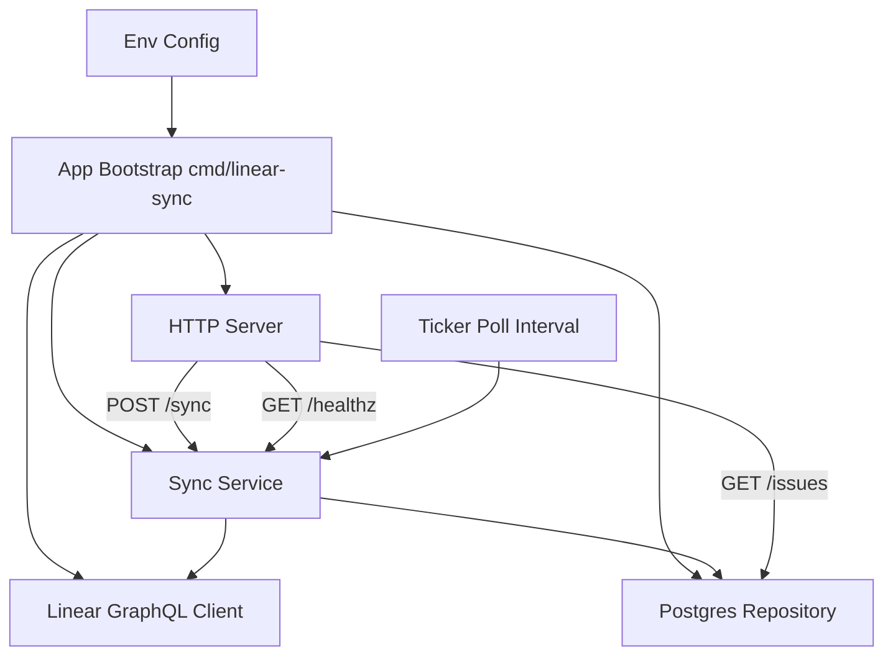

# Plan

> Authored by the Architect. The initial section below is the primary plan; remediation cycles append `## Remediation Cycle N` sections and never rewrite this header.

## Overview

Build `linear-sync` as a small Go HTTP service with clear package boundaries: configuration/bootstrap, Linear GraphQL client, Postgres repository, sync orchestrator (singleflight + retry + poller), and HTTP handlers. A foreground `Sync(ctx)` path is shared by the 5-minute poller and `POST /sync`, while `GET /issues` reads from Postgres and `GET /healthz` reports DB reachability plus sync/shutdown state. The service fails fast on missing required env vars, creates/maintains the fixed `issues` schema, uses context-aware operations throughout, and performs graceful shutdown on signals.

Risks/trade-offs: polling can miss very short-lived intermediate issue states between intervals; retry/backoff improves resilience but may delay a cycle under prolonged failures; requiring explicit team configuration avoids accidental global sync but adds one more runtime variable. Open questions: confirm the exact team selector env name (`TEAM_ID` vs `LINEAR_TEAM_ID`) and whether `/healthz` should include last sync metadata in body or status-only output.

## Delivery Target

Repository-backed Go module at workspace root implementing `github.com/bryanbarton525/linear-sync` with runnable command in `cmd/linear-sync`, internal packages, tests, and README usage instructions.

## Tech Stack

- Go 1.22+
- net/http
- log/slog
- github.com/jackc/pgx/v5/pgxpool
- Linear GraphQL over HTTPS (standard library http client)
- context, errgroup/sync primitives for lifecycle and concurrency
- testing + httptest

## Components

| Name | Description | Inputs | Outputs |
|---|---|---|---|
| Runtime configuration | Loads environment variables, validates required values, parses poll interval with default 300s, and provides typed config to the app. | LINEAR_API_KEY, DATABASE_URL, POLL_INTERVAL (optional), LOG_LEVEL (optional), TEAM_ID (or agreed team env var) | Config struct, Startup validation errors |
| Linear GraphQL client | Calls Linear GraphQL API with bearer auth, fetches issues for the configured team (with pagination), and maps response into internal issue model. | context.Context, API key, team identifier | []IssueRecord (id, title, status, priority, updated_at) |
| Postgres repository | Manages pgx pool, ensures `issues` table exists, upserts issues guarded by updated_at freshness, lists issues, and checks DB health. | context.Context, DATABASE_URL, IssueRecord rows | Persisted issue rows, []IssueRecord for API responses, health status errors |
| Sync orchestrator and poller | Provides serialized `Sync(ctx)` execution (shared by poller and manual trigger), retries transient failures with exponential backoff, tracks last successful sync, and runs ticker-based polling. | context.Context, poll interval, Linear client, repository | Sync result metadata, structured logs, poll loop lifecycle |
| HTTP API server | Exposes `GET /issues`, `POST /sync`, and `GET /healthz`; returns JSON responses and proper status codes; coordinates shutdown readiness state. | context.Context, sync orchestrator, repository, shutdown signal | HTTP responses, non-200 health during shutdown |

## Architectural Decisions

1. **Use `pgx/v5/pgxpool` for PostgreSQL access and parameterized SQL upserts.**
   - Rationale: Provides robust Postgres support, pooling, and performant batched operations in idiomatic Go.
   - Tradeoffs: Adds direct pgx dependency instead of stdlib `database/sql`; SQL remains hand-written.
2. **Implement a single shared `Sync(ctx)` path protected by singleflight-style deduplication/serialization.**
   - Rationale: Prevents overlapping poll and manual sync runs while keeping behavior consistent across triggers.
   - Tradeoffs: Concurrent manual requests may wait for in-flight sync instead of running independently.
3. **Upsert with `ON CONFLICT (id) DO UPDATE ... WHERE excluded.updated_at > issues.updated_at`.**
   - Rationale: Preserves newest Linear state and avoids regressing rows with stale payloads.
   - Tradeoffs: Equal timestamps do not rewrite rows; assumes Linear `updatedAt` monotonicity is sufficient.
4. **Health endpoint reflects DB connectivity and process shutdown state; during shutdown it returns non-200.**
   - Rationale: Supports orchestrator drain behavior and satisfies graceful shutdown acceptance expectations.
   - Tradeoffs: Transient DB blips can surface as unhealthy even if service might recover quickly.

## Task Graph

| ID | Specialty | Title | Depends On | Description |
|---|---|---|---|---|
| 516f1022 | backend | Initialize module, configuration, and core issue model | - | Produce artifact kind `code`, names `go.mod`, `go.sum`, `internal/config/config.go`, and `internal/model/issue.go`, written into the workspace. Set module path to `github.com/bryanbarton525/linear-sync`. In `internal/config`, implement a `Config` struct and `Load() (Config, error)` that reads env vars `LINEAR_API_KEY`, `DATABASE_URL`, optional `POLL_INTERVAL` (seconds, default 300), optional `LOG_LEVEL`, and team identifier env (`TEAM_ID` unless project standard differs); required vars must fail with explicit errors and no secret values in error text. In `internal/model`, define a concrete issue type with fields matching sync contract: id, title, status, priority, updated_at (`time.Time`). Add table-driven unit tests in `internal/config/config_test.go` covering defaults, parse failures, and missing required vars. Quality constraints: idiomatic Go, no `any` in public APIs, context-aware signatures for future blocking methods, files must compile in workspace with `go test`. |
| 3cf16869 | backend | Implement Linear GraphQL client with team-scoped pagination | Initiali | Produce artifact kind `code`, names `internal/linear/client.go` and `internal/linear/client_test.go`, written into the workspace. Implement package `linear` with a client that calls Linear GraphQL over HTTPS using `Authorization: Bearer <LINEAR_API_KEY>`, fetches issues for the configured team, paginates until complete, and returns deterministic `[]model.Issue` mapped from Linear fields (`id`, `title`, `state.name` to status, `priority`, `updatedAt`). Export constructor and method signatures that accept `context.Context` for network calls. Implement strict error handling for non-2xx responses, GraphQL errors array, malformed payloads, and timestamp parse failures using wrapped errors. Tests must use `httptest.NewServer()` with fresh `http.ServeMux`, validate request auth/body shape, pagination behavior, field mapping, and error paths. Use artifact from task `Initialize module, configuration, and core issue model` as input types and module context. |
| 8b1ae7df | backend | Build Postgres repository for schema, upsert, listing, and health | Initiali | Produce artifact kind `code`, names `internal/storage/postgres/repo.go` and `internal/storage/postgres/repo_test.go`, written into the workspace. Implement package `postgres` with a repository backed by `pgxpool` that: (1) ensures table `issues` exists with exact schema `id text primary key, title text, status text, priority int, updated_at timestamptz`; (2) upserts multiple issues using parameterized SQL and conflict handling that only updates when incoming `updated_at` is newer; (3) lists issues for API output; (4) provides health check via lightweight DB query (`Ping` or `SELECT 1`) with context. Expose context-first methods and return explicit wrapped errors. Add tests for SQL generation/behavior with test doubles or pgx-compatible mocking to cover upsert freshness guard, list mapping, and health error path. Inputs: `model.Issue` from prior task and module dependencies already initialized. |
| ff178c7e | backend | Create sync service with retry, deduplicated manual trigger, and poller loop | Implemen, Build Po | Produce artifact kind `code`, names `internal/sync/service.go` and `internal/sync/service_test.go`, written into the workspace. Implement package `sync` that composes the Linear client and Postgres repository and exposes `Sync(ctx context.Context) (Result, error)` plus `RunPoller(ctx context.Context)` using configured interval. `Sync` must be serialized/deduplicated (singleflight or equivalent) so concurrent `POST /sync` and poll ticks do not run overlapping imports. Add bounded exponential backoff retry for transient failures during a sync invocation, with cancellation respecting `ctx.Done()`. Track last sync status/time in service state for health reporting. Tests must cover deduplication, retry progression, cancellation behavior, and poll tick invoking sync logic. Inputs: artifacts from Linear client and Postgres repo tasks; preserve shared sync logic used by both poller and manual endpoint. |
| 2b8972fb | backend | Wire HTTP handlers and application bootstrap with graceful shutdown | Create s | Produce artifact kind `code`, names `internal/httpapi/handler.go`, `internal/httpapi/handler_test.go`, `cmd/linear-sync/main.go`, and `cmd/linear-sync/main_test.go` (if bootstrap testable), written into the workspace. Implement `GET /issues` (JSON array from repository list), `POST /sync` (triggers foreground shared sync and returns 200 on success), and `GET /healthz` (200 when healthy, non-200 during shutdown or DB-unhealthy). Use `net/http`, proper JSON headers/statuses, and clear error bodies without leaking secrets. In `main.go`, load config, initialize logger, DB pool/repo, ensure schema, create Linear client and sync service, start poller and HTTP server, and handle SIGINT/SIGTERM for graceful shutdown: stop poller, cancel contexts, shut down HTTP server, close DB pool. Ensure all long-running calls accept context. Tests must use `httptest.NewServer`, custom mux (not default), and cover endpoint success/error cases including health during shutdown signal state. Inputs: config, sync service, and repository artifacts from previous tasks. |
| 4af76efe | writer | Document runtime configuration and local run/test instructions | Wire HTT | Produce artifact kind `markdown`, name `README.md`, written into the workspace. Document service purpose, required env vars (`LINEAR_API_KEY`, `DATABASE_URL`, team identifier env), optional vars (`POLL_INTERVAL`, `LOG_LEVEL`), and all endpoints (`GET /issues`, `POST /sync`, `GET /healthz`) with example curl commands and expected status behavior. Include concise setup steps for local Postgres, running `go run ./cmd/linear-sync`, and validating acceptance (`go build ./...`, `go test ./...`, table schema expectations, and poll/manual sync behavior). Keep instructions aligned with implemented file/package paths and module path `github.com/bryanbarton525/linear-sync`. Input: completed code artifacts from all prior tasks. |

